## Azure告警对接

## 一、背景

 1、客户需求是Azure告警对接至我方产品，在研究Azure官方文档后决定使用rest api方式调用接口获取azure告警，在这个过程中token的获取方式耗费了很长时间，本文在此做一个总结。

 2、此次采用OAuth2.0协议的客户端凭据授予的方式，即直接使用client id 和 secret获取令牌。

 3、关于1.0和2.0版本的区别可以参考https://docs.azure.cn/zh-cn/active-directory/azuread-dev/azure-ad-endpoint-comparison 此文档

## 二、Azure门户操作步骤

 1、新建AAD应用：导航到Azure门户的AAD界面，选择应用注册，点击新注册。

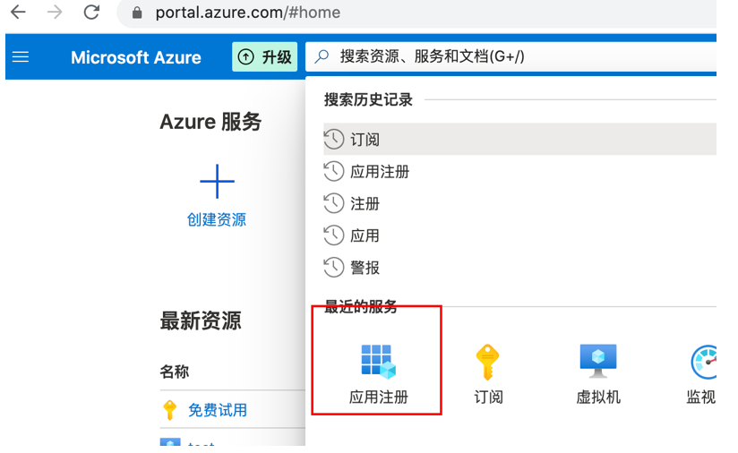

 按照下图填写信息，如果选择多租户是允许访问其他租户的应用；由于我们不涉及到登陆的内容，所以重定向URI无需填写。

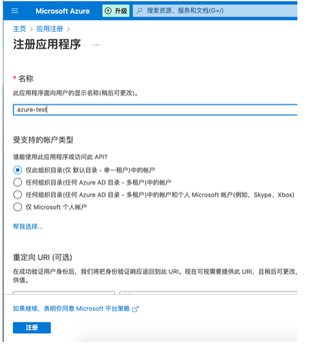

2、按照下图的方式，授予AAD应用访问Azure管理服务API权限

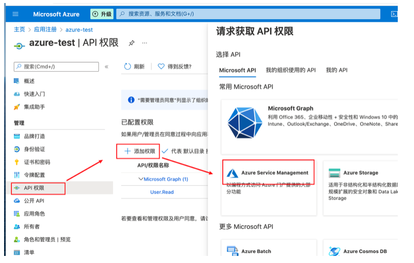

 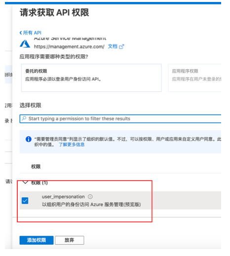

3、接下来授予AAD 应用服务的访问权限，在相关服务的访问控制页面授予AAD应用参与者权限（建议赋予订阅的权限，这样可以操作所有应用）

 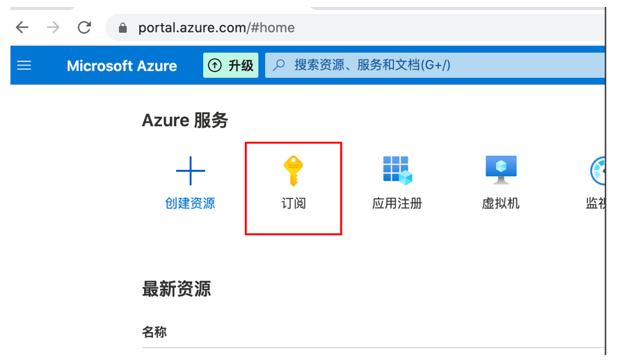

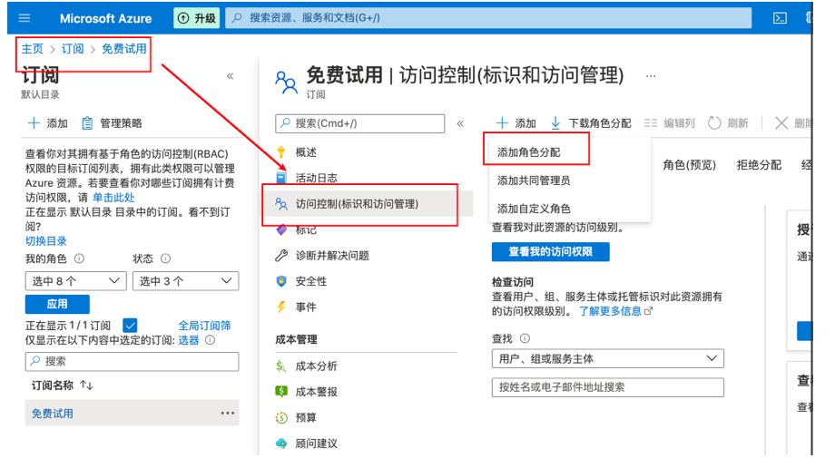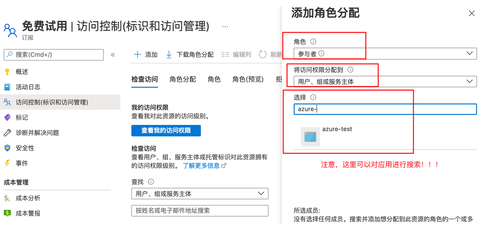

4、收集AAD应用信息，需要租户id，client id，client secret。

 进入AAD页面，按照下图方式生成密钥，并且保存密钥，该密钥为client secret（注意，这个密钥在第一次生成时才能看到，所以必须保存）

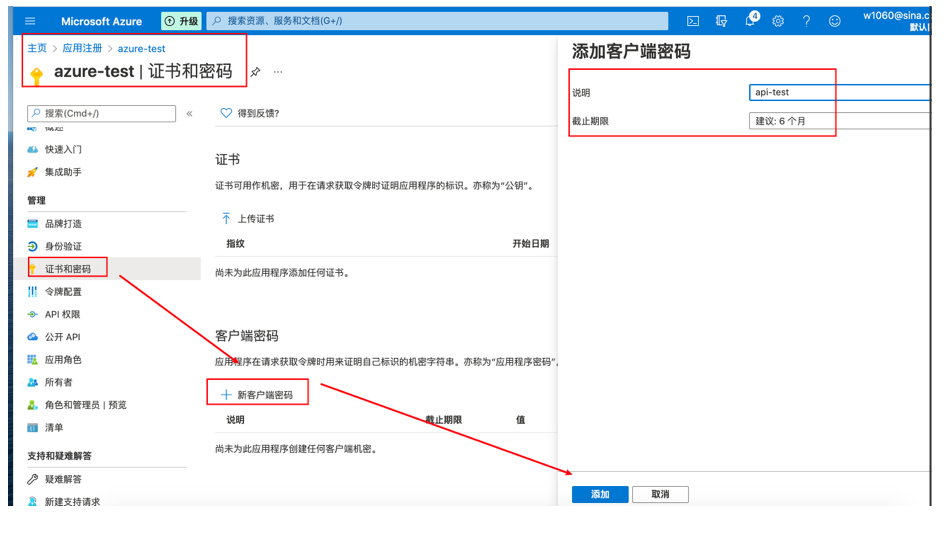

 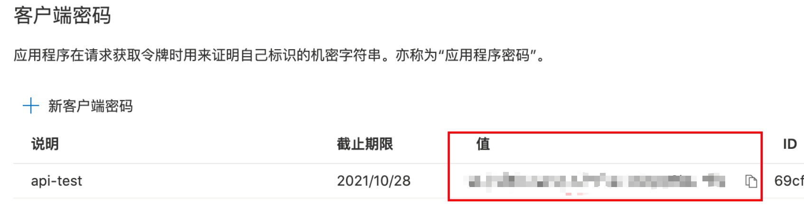

 按照下图收集client id和租户id

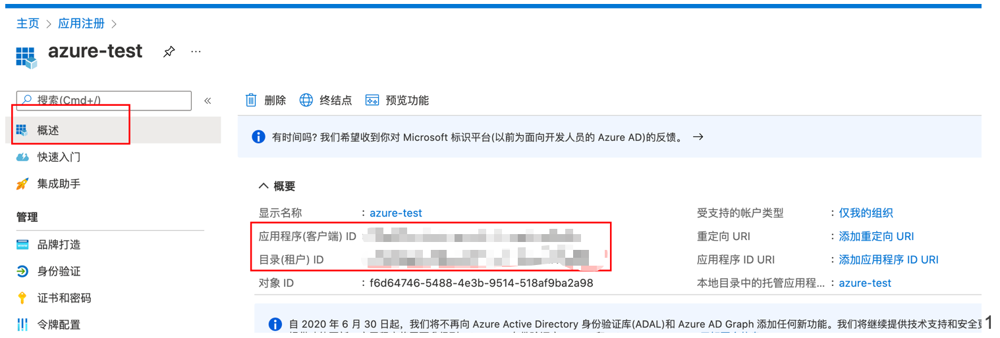

## 三、监控资源告警配置

 1、在想要监控的资源下新建告警规则（或者在监控资源下统一新建）

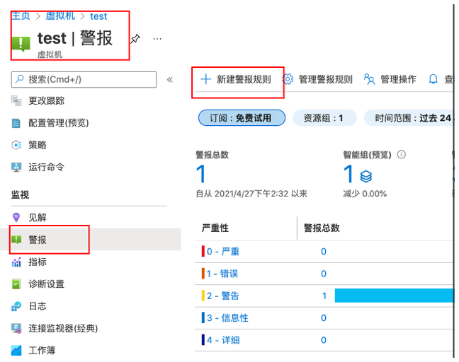

2、添加监控的条件

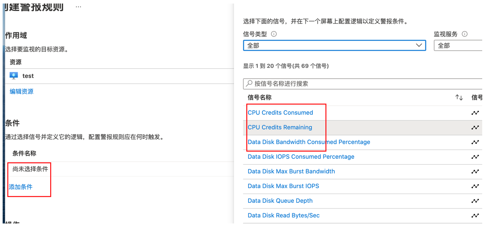

 配置信号逻辑

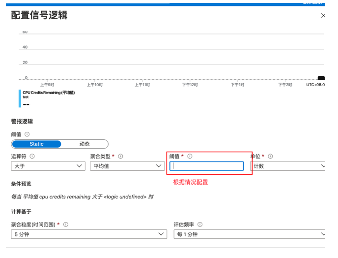

3、警报规则建立后，等待生效即可

 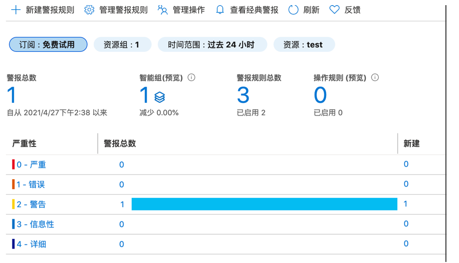

## 四、rest api调用

1、获取token

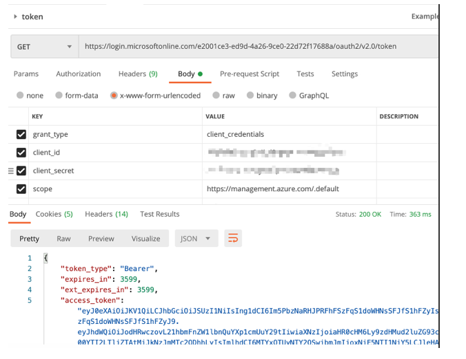

2、获取告警列表

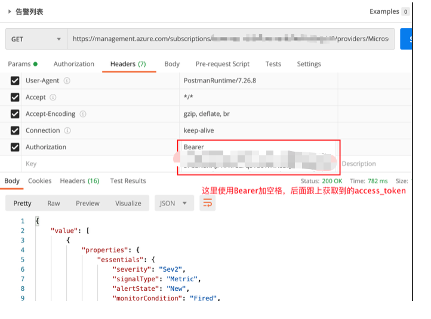

3、根据告警列表中的id获取告警详情

## 五、注意

1、azure使用的域名和scope根据区域的不同各有不同

 域名参考：https://docs.azure.cn/zh-cn/articles/guidance/developerdifferences?toc=%2fguides%2fdeveloper%2ftoc.json#check-endpoints-in-azure

 此次用到的域名如下：

| 服务类别             | Azure全球URI                                                 | Azure URI（中国）                                            |
| :------------------- | :----------------------------------------------------------- | :----------------------------------------------------------- |
| Azure AD 登录        | [https://login.microsoftonline.com](https://login.microsoftonline.com/) | [https://login.partner.microsoftonline.cn](https://login.partner.microsoftonline.cn/) |
| Azure 资源管理 (ARM) | [https://management.azure.com](https://management.azure.com/) | [https://management.chinacloudapi.cn](https://management.chinacloudapi.cn/) |

2、token具有失效时间、需要定时获取

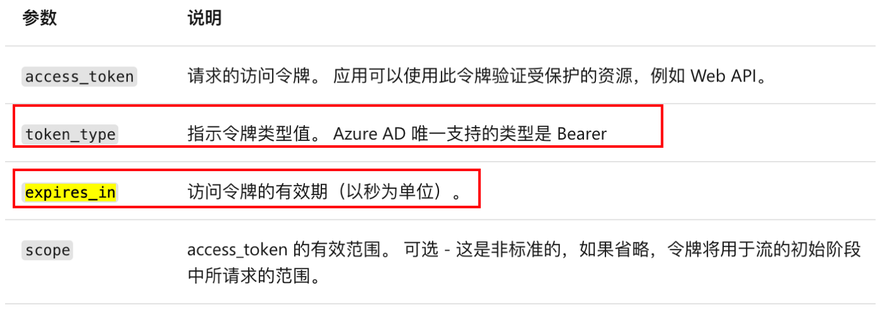

## 参考资料：

rest api警报概述：
https://docs.microsoft.com/zh-cn/azure/azure-monitor/alerts/alerts-overview

列出所有现有警报：
https://docs.microsoft.com/zh-cn/rest/api/monitor/alertsmanagement/alerts/getall

OAuth2.0:
https://docs.microsoft.com/zh-cn/azure/active-directory/develop/v2-oauth2-auth-code-flow

token获取方式：

https://www.cnblogs.com/junshijie/p/12688188.html

各区域域名对比：

https://docs.azure.cn/zh-cn/articles/guidance/developerdifferences?toc=%2fguides%2fdeveloper%2ftoc.json#check-endpoints-in-azure

 
